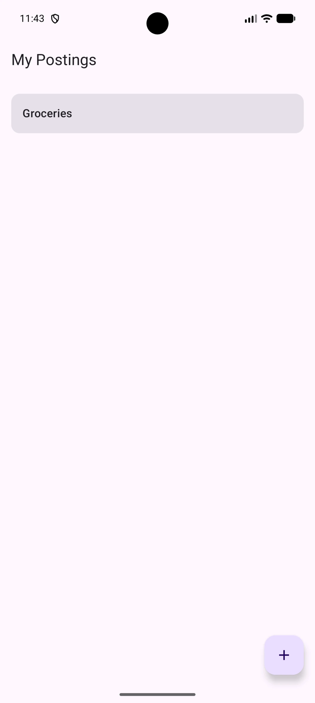
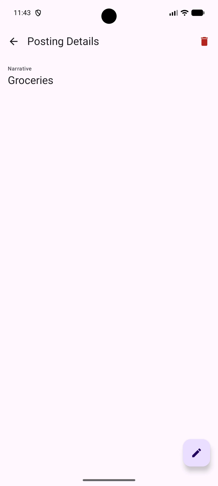
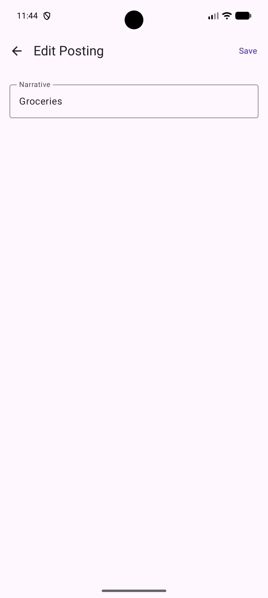

# Ledger


**Supported Platforms:**


---

**Ledger** is a Kotlin Multiplatform reference project for Android, iOS, and Desktop. Its primary goal is to demonstrate production-grade architecture and design patterns using the latest Jetpack and Compose Multiplatform libraries — including several that are still in alpha or beta. It is intentionally simple in domain (basic financial postings) so that the architecture, not the business logic, is the focus.

> **Note:** Kotlin, Compose Multiplatform, Navigation 3, Koin, and Coroutines are all on stable releases. The exceptions are libraries the wider Kotlin ecosystem hasn't stabilized yet: Room 3 / AndroidX SQLite (Release Candidate), AndroidX Lifecycle and Material3 Adaptive (Beta), and Material3 components (Alpha). Pinned versions are recorded in [`gradle/libs.versions.toml`](gradle/libs.versions.toml).

---

## Screenshots

|                      Posting List                       |                      Posting Detail                       |                      Edit Posting                       |
|:-------------------------------------------------------:|:---------------------------------------------------------:|:-------------------------------------------------------:|
|  |  |  |

---

## Tech Stack

| Library | Version | Role |
|---|---|---|
| Kotlin | 2.4.0 | Language and compiler |
| Kotlin Gradle Plugin | 2.4.0 | Build tooling |
| Compose Multiplatform | 1.11.1 | Shared UI (Android, iOS, Desktop) |
| Room 3 / SQLite | 3.0.0-rc01 / 2.7.0-rc01 | Local database with KMP support |
| Navigation 3 | 1.1.3 (runtime) / 1.1.1 (ui) | Type-safe declarative navigation |
| Koin | 4.2.2 | Dependency injection with annotation processing |
| Kermit | 2.1.0 | Kotlin Multiplatform logging |
| Kover | 0.9.8 | Kotlin Multiplatform code coverage |
| SLF4J / Logback | 2.0.18 / 1.5.34 | Desktop logging implementation |
| Swift Export | Experimental | Direct Kotlin-to-Swift bridge (No Obj-C) |
| Kotlinx Coroutines | 1.11.0 | Async and Flow-based data streams |
| Lifecycle / ViewModel | 2.11.0-beta02 | State management and lifecycle-aware components |
| Material3 Adaptive | 1.3.0-beta02 | List/detail adaptive layouts |
| Material3 (Compose) | 1.11.0-alpha07 | Material You components |
| Android SDK | compile/target 37, min 24 | Android target |

---

## Architecture

Ledger follows a strict unidirectional layered architecture. Each layer depends only on the layer directly below it, and all domain types flow upward through mappers — never raw database entities.

```
┌─────────────────────────────────────┐
│ androidApp / iosApp / desktopApp    │  Platform entry points
└───────┬──────────────┬──────────────┘
        │              │
        │      ┌───────▼───────┐
        │      │   iosExport   │  Swift Export bridge
        │      └───────┬───────┘
        │              │
┌───────▼──────────────▼──────────────┐
│              core:ui                │  App composable, theme, NavDisplay setup
│           core:navigation           │  Navigator, StartDestination
│           core:bootstrap            │  Root Koin module wiring
└────────────────┬────────────────────┘
                 │
┌────────────────▼────────────────────┐
│       feature:posting:impl          │  Screens, ViewModels, DI
│       feature:posting:api           │  Navigation keys (NavKey contracts)
└────────────────┬────────────────────┘
                 │
┌────────────────▼────────────────────┐
│           core:domain               │  Use cases (SavePosting, GetPosting, …)
│           core:common               │  DataResult, shared utilities
│           core:compose              │  Shared Compose components
└────────────────┬────────────────────┘
                 │
┌────────────────▼────────────────────┐
│            core:data                │  PostingRepository, mappers
└────────────────┬────────────────────┘
                 │
┌────────────────▼────────────────────┐
│           core:database             │  Room 3 database, DAOs, entities, TypeConverters
└─────────────────────────────────────┘

Supporting modules (no layer dependency):
  core:model   — pure Kotlin domain models (Posting, NewPosting)
  core:test    — shared test utilities (FakePostingRepository)
  build-logic  — Gradle convention plugins
```

### Module responsibilities

| Module | Responsibility |
|---|---|
| `core:model` | Pure Kotlin data classes with no framework dependency. The single source of truth for domain types. |
| `core:database` | Room 3 entities, DAOs, TypeConverters, and platform-specific database builders. |
| `core:data` | `PostingRepository` interface and its `OfflineFirstPostingRepository` implementation. Contains entity↔model mappers. |
| `core:domain` | One use case per operation (`GetPostingUseCase`, `SavePostingUseCase`, `DeletePostingUseCase`, `GetPostingsUseCase`). Each wraps a repository call with a single responsibility. |
| `core:common` | `DataResult<T>` sealed interface and the `Flow<T>.asResult()` extension. |
| `core:compose` | Shared Compose components used across feature modules (e.g. `LabeledField`). |
| `core:navigation` | `Navigator` (backstack wrapper) and `StartDestination` value class. Framework-agnostic. |
| `core:ui` | Root `App` composable, Material 3 theme, `NavDisplay` wiring. |
| `core:bootstrap` | Root Koin module that wires all sub-modules together and provides `StartDestination` and `SavedStateConfiguration`. |
| `core:test` | `FakePostingRepository` and `PlatformComposeUiTest` expect/actual. Consumed by all test source sets. |
| `iosExport` | Bridge module for Swift Export. Contains the `MainViewController` and Koin initialization for iOS. |
| `feature:posting:api` | `NavKey` data classes (`PostingList`, `PostingDetail`, `PostingEdit`) and their serializers module. Consumed by both the feature impl and the bootstrap/navigation modules. |
| `feature:posting:impl` | `PostingListScreen`, `PostingDetailsScreen`, `PostingEditScreen`, their ViewModels, and the Koin navigation module (`postingNavigationModule`). |

---

## Design Patterns

### 1. Convention plugins (`build-logic`)

Rather than duplicating Gradle configuration across modules, all shared setup lives in three composable convention plugins:

```
ledger.kotlin.multiplatform          → KMP + Android library targets, JVM 17, kotlin-test
  └─ (applied automatically)          → + JetBrains Kover (code coverage)
  └─ ledger.kotlin.multiplatform.koin     → + Koin core, annotations, and compiler plugin
       └─ ledger.kotlin.multiplatform.koin.compose  → + Compose, resources, ui-test, core:test
```

Each module picks the plugin that matches its needs. A UI feature module uses one line:

```kotlin
// feature/posting/impl/build.gradle.kts
plugins {
    id("ledger.kotlin.multiplatform.koin.compose")
}
```

A pure domain module uses the lighter variant:

```kotlin
// core/domain/build.gradle.kts
plugins {
    id("ledger.kotlin.multiplatform.koin")
}
```

### 2. Feature API / Implementation split

Each feature is split into two modules:

- **`feature:posting:api`** — contains only the `NavKey` sealed types that other modules reference for navigation. Has no dependency on Compose or domain logic.
- **`feature:posting:impl`** — contains the screens, ViewModels, and DI. Depends on `api` but is never depended on by any other feature or core module.

This means modules that need to navigate *to* a feature only depend on `api`, keeping compile-time coupling minimal.

### 3. `DataResult` + `asResult()` for UI state

`DataResult<T>` is a sealed interface that wraps any Flow into three standard states:

```kotlin
sealed interface DataResult<out T> {
    data class Success<T>(val data: T) : DataResult<T>
    data class Error(val exception: Throwable) : DataResult<Nothing>
    data object Loading : DataResult<Nothing>
}

fun <T> Flow<T>.asResult(): Flow<DataResult<T>> = map { DataResult.Success(it) }
    .onStart { emit(DataResult.Loading) }
    .catch { emit(DataResult.Error(it)) }
```

ViewModels call `.asResult()` on any domain Flow and `when`-switch the result directly into a sealed UI state, keeping the mapping explicit and exhaustive:

```kotlin
getPostingsUseCase()
    .asResult()
    .map { result ->
        when (result) {
            is DataResult.Loading -> PostingListUiState.Loading
            is DataResult.Success -> if (result.data.isEmpty()) PostingListUiState.Empty
                                     else PostingListUiState.Success(result.data)
            is DataResult.Error   -> PostingListUiState.Error
        }
    }
```

### 4. `expect`/`actual` for platform database initialisation

Room 3 requires a platform-specific builder. Ledger uses an `expect class` to enforce that every platform provides its own builder, while common code only sees the abstract `RoomDatabase.Builder<LedgerDatabase>`:

```kotlin
// commonMain — contract
@Module
expect class PlatformDatabaseModule

// androidMain — Android implementation using Context
@Module actual class PlatformDatabaseModule {
    @Single
    fun provideRoomBuilder(@Provided context: Context): RoomDatabase.Builder<LedgerDatabase> =
        Room.databaseBuilder(context, name = context.getDatabasePath("ledger.db").absolutePath)
}

// jvmMain — Desktop implementation with OS-aware file path
@Module actual class PlatformDatabaseModule {
    @Single
    fun provideRoomBuilder(): RoomDatabase.Builder<LedgerDatabase> =
        Room.databaseBuilder(name = jvmDatabaseFile().absolutePath)
}
```

The JVM implementation resolves the correct data directory for macOS (`~/Library/Application Support`), Windows (`%APPDATA%`), and Linux (`$XDG_DATA_HOME` or `~/.local/share`).

### 5. Koin annotation-driven DI

All modules and bindings are declared with Koin annotations rather than DSL, enabling compile-time validation of the dependency graph:

```kotlin
@Module(includes = [DataModule::class])
@ComponentScan("app.oreshkov.ledger.core.domain")
class DomainModule

@Factory
class GetPostingUseCase(private val repository: PostingRepository) { ... }

@KoinViewModel
class PostingDetailsViewModel(
    @Provided private val getPostingUseCase: GetPostingUseCase,
    @Provided private val deletePostingUseCase: DeletePostingUseCase,
    @InjectedParam private val postingId: String
) : ViewModel()
```

### 6. Navigation 3 with `koinEntryProvider`

Screens are registered as Koin navigation entries, keeping navigation and DI fully integrated without manual ViewModel factories:

```kotlin
val postingNavigationModule = module {
    navigation<PostingList>(metadata = ListDetailSceneStrategy.listPane()) {
        val navigator = LocalNavigator.current
        PostingListScreen(
            onNavigateToEdit = { id -> navigator.goTo(PostingEdit(id)) },
            onNavigateToDetails = { id -> navigator.goTo(PostingDetail(id)) },
            viewModel = koinViewModel()
        )
    }
    navigation<PostingDetail>(metadata = ListDetailSceneStrategy.detailPane()) { route ->
        val navigator = LocalNavigator.current
        PostingDetailsScreen(
            onNavigateBack = { navigator.goBack() },
            viewModel = koinViewModel(parameters = { parametersOf(route.id) })
        )
    }
}
```

### 7. Multiplatform Logging with Kermit

Ledger uses **Kermit** for unified logging. Platform-specific writers are provided via `expect`/`actual` functions in `core:common`, ensuring that logs are routed to the appropriate system (Logcat on Android, OSLog on iOS, and SLF4J/Logback on Desktop).

---

## Testing Strategy

All tests use pure Kotlin — no mocking framework.

**Fakes over mocks:** `FakePostingRepository` is a full in-memory implementation of `PostingRepository` backed by a `MutableStateFlow`. It exposes `insertedPostings`, `deletedPostings`, and `updatedPostings` lists for assertions, and `failNextWrite` / `shouldThrowOnGetById` flags to simulate error conditions without any mock library.

**ViewModel tests** use `UnconfinedTestDispatcher` set as the main dispatcher in `@BeforeTest`, ensuring coroutines and `StateFlow` updates run eagerly and can be asserted synchronously.

**Code Coverage:**
The project uses **JetBrains Kover** for multiplatform coverage tracking. Coverage is automatically collected for all `commonMain` logic across JVM and Android targets. Reports are aggregated at the root project level and filtered to exclude generated code (Koin factories, Compose singletons, etc.).

In CI, the `check` job runs `koverXmlReport` and posts a coverage summary as a comment on each pull request, alongside a test-results summary with inline annotations for any failures. The aggregated HTML report is also uploaded as a build artifact.

**Layer coverage:**

| Layer | Test approach |
|---|---|
| `core:database` | DAO tests against a real in-memory Room 3 database |
| `core:data` | `OfflineFirstPostingRepositoryTest` with `FakePostingDao` |
| `core:domain` | Use case tests with `FakePostingRepository` |
| `core:common` | `DataResultTest` for the `asResult()` extension |
| `feature:posting:impl` | ViewModel unit tests + Compose UI tests (screen-level) |
| `core:ui` | App-level Compose UI test |
| DI modules | Compile-time validation (Koin Compiler Plugin) + App-level integration tests |

---

## Getting Started

### Prerequisites

- Android Studio Meerkat or newer
- JDK 17+

### Run on Android

```bash
./gradlew :androidApp:installDebug
```

### Run on Desktop

```bash
./gradlew :desktopApp:run
```

### Run on iOS

1.  Open `iosApp/iosApp.xcodeproj` in Xcode.
2.  Select a simulator or real device.
3.  Click **Run**.

> **Note:** The iOS app uses the experimental **Swift Export** for direct Kotlin-to-Swift interoperability. For ProMotion (120Hz) support, ensure `CADisableMinimumFrameDurationOnPhone` is set to `YES` in the **Target > Info** tab of the Xcode project (Xcode 13+ manages this via a generated plist).

### Run all tests

```bash
./gradlew allTests
```

### Generate Coverage Report

```bash
./gradlew koverHtmlReport
```
The aggregated report will be generated at `build/reports/kover/html/index.html`.

---

## Project Structure

```
kmp-ledger/
├── build-logic/                  # Convention plugins
│   └── src/main/kotlin/
│       ├── ledger.kotlin.multiplatform.gradle.kts
│       ├── ledger.kotlin.multiplatform.koin.gradle.kts
│       └── ledger.kotlin.multiplatform.koin.compose.gradle.kts
├── gradle/
│   └── libs.versions.toml        # Centralised version catalog
├── androidApp/                   # Android entry point
├── iosApp/                       # iOS entry point (Swift)
├── desktopApp/                   # Desktop (JVM) entry point
├── iosExport/                    # Swift Export bridge for iOS
├── core/
│   ├── bootstrap/                # Root DI wiring
│   ├── common/                   # DataResult, asResult()
│   ├── compose/                  # Shared Compose components
│   ├── data/                     # Repository implementations and mappers
│   ├── database/                 # Room 3 database, DAOs, TypeConverters
│   ├── domain/                   # Use cases
│   ├── model/                    # Pure domain models
│   ├── navigation/               # Navigator, StartDestination
│   ├── test/                     # Shared test utilities
│   └── ui/                       # App composable, theme
└── feature/
    └── posting/
        ├── api/                  # NavKey contracts
        └── impl/                 # Screens, ViewModels, DI
```

---

## License

This project is licensed under the MIT License — see the [LICENSE](LICENSE) file for details.

---

## Releasing

To release a new version:

1. Update `ledger.version.name` and `ledger.version.code` in `gradle.properties`.
2. Add the new version and its changes to `CHANGELOG.md` under the `## [Unreleased]` section.
3. Once ready, change `## [Unreleased]` to `## [x.y.z] - YYYY-MM-DD`.
4. Commit and push your changes to `main`.
5. Create and push a new tag:
   ```bash
   git tag v1.0.0
   git push origin v1.0.0
   ```
6. The GitHub Release workflow will automatically build the binaries and create a GitHub Release with the changelog notes.

### Android release signing

The release workflow signs the Android APK when the following **repository secrets**
(Settings → Secrets and variables → Actions) are present. If they are absent, the
release job logs a warning and produces an unsigned APK; local `assembleRelease`
builds are always unsigned.

| Secret | Description |
|---|---|
| `ANDROID_KEYSTORE_BASE64` | The signing keystore (`.jks`/`.keystore`) file, base64-encoded without line wrapping (`base64 -w0 your.jks`). |
| `ANDROID_KEYSTORE_PASSWORD` | Password for the keystore (store password). |
| `ANDROID_KEY_ALIAS` | Alias of the signing key inside the keystore. |
| `ANDROID_KEY_PASSWORD` | Password for that key (equal to the store password for PKCS12 keystores). |

The alias and passwords are chosen when the keystore is created
(`keytool -genkeypair -keystore your.jks -alias <alias> -keyalg RSA -keysize 2048 -validity 10000 -storetype PKCS12`).
Keep the keystore backed up and private — for Google Play distribution it is your
**upload key**, and updates must be signed with the same key.