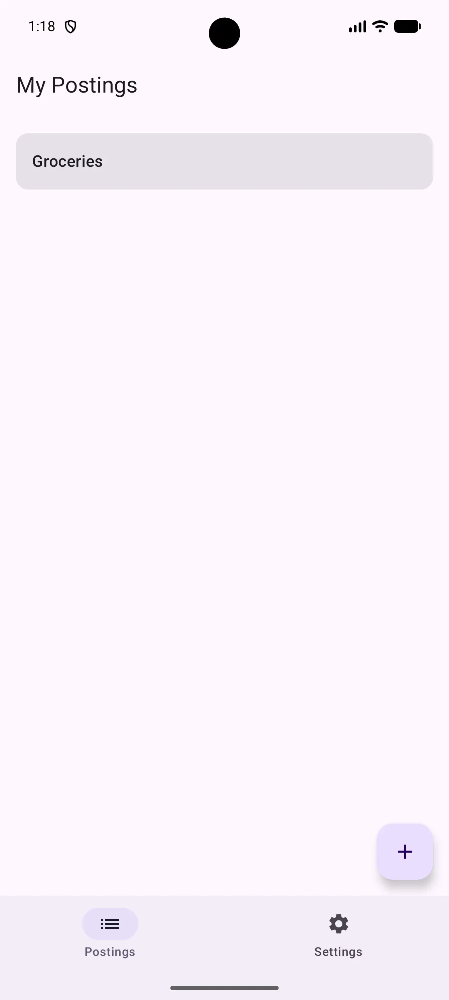
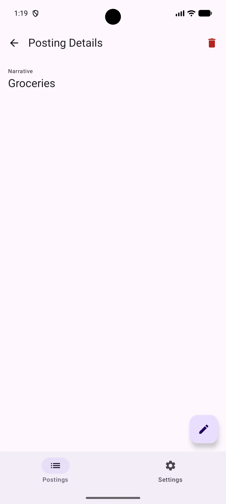
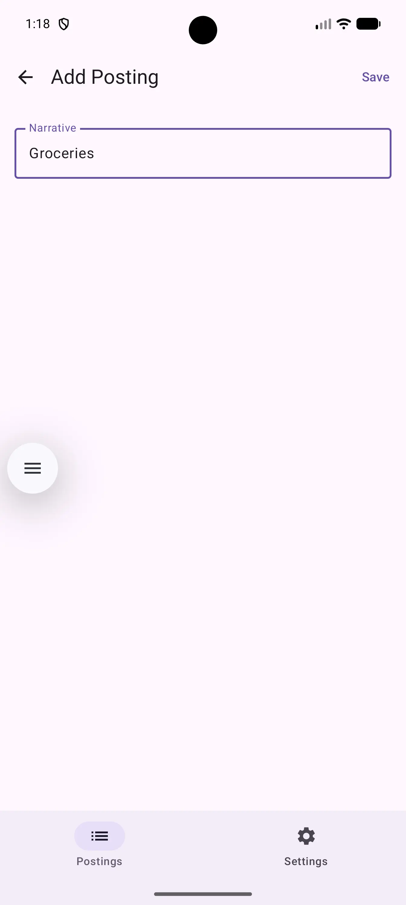
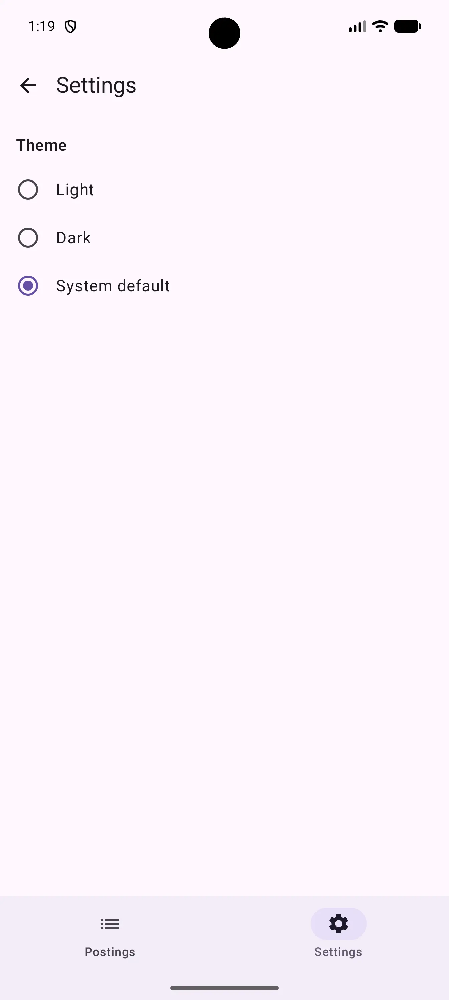
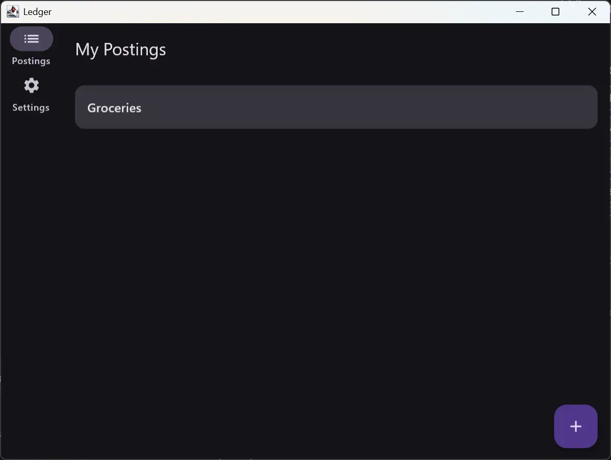
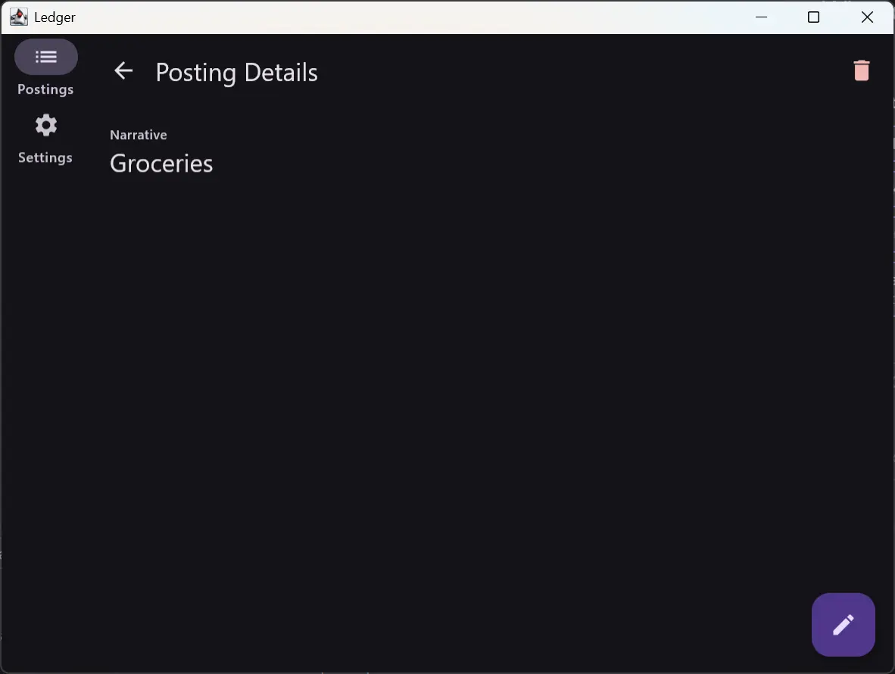
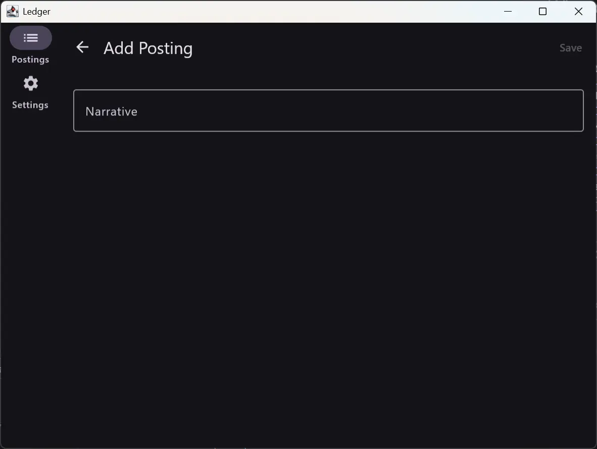
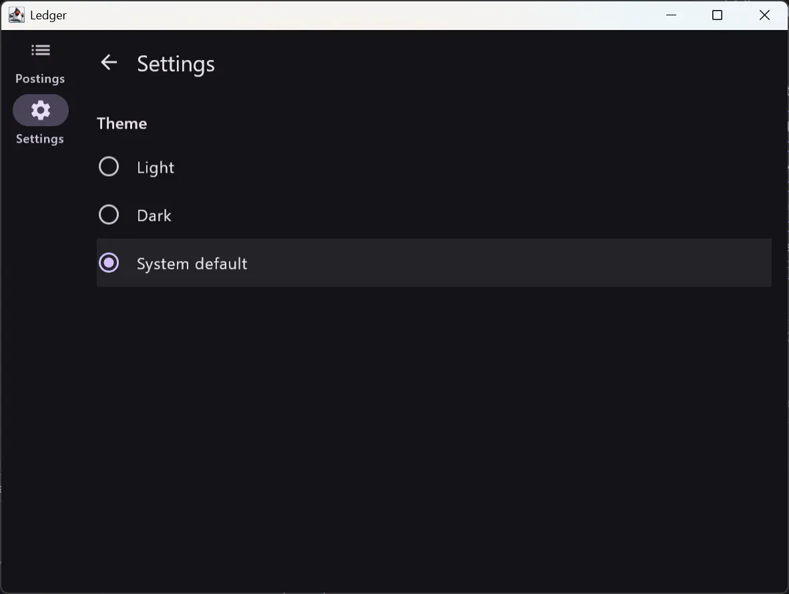

# Ledger


[](https://scorecard.dev/viewer/?uri=github.com/aoreshkov/kmp-ledger)
[](https://github.com/sponsors/aoreshkov)
[](https://plugins.jetbrains.com/plugin/31786-kmp-project-wizard)

**Supported Platforms:**


---

**Ledger** is a Kotlin Multiplatform reference project for Android, iOS, and Desktop. Its primary goal is to demonstrate production-grade architecture and design patterns using the latest Jetpack and Compose Multiplatform libraries — including several that are still in alpha or beta. It is intentionally simple in domain (basic financial postings) so that the architecture, not the business logic, is the focus.

> **Note:** Kotlin, Compose Multiplatform, Navigation 3, Room 3 / AndroidX SQLite, Koin, Coroutines, and AndroidX DataStore are all on stable releases. The exceptions are libraries the wider Kotlin ecosystem hasn't stabilized yet: AndroidX Lifecycle and Material3 Adaptive (Beta), and Material3 components — including the Adaptive Navigation Suite — (Alpha). Pinned versions are recorded in [`gradle/libs.versions.toml`](gradle/libs.versions.toml).

---

## Generate This Project

Want this architecture as the starting point for your own app? The
[KMP Project Wizard](https://plugins.jetbrains.com/plugin/31786-kmp-project-wizard) plugin for
IntelliJ IDEA and Android Studio generates a project with this exact module structure straight
from **File → New Project** — tailored to your package name, feature and entity names, and
target platforms. Ledger is the open-source reference app the wizard's defaults mirror.

The core Android and Desktop templates are free. A **Pro** tier additionally generates the
Claude Code agent configuration and GitHub Actions CI scaffolding — the same setups you can
study in this repo (`.claude/`, `.github/workflows/`) — pre-wired to your project in one click.

---

## Screenshots

### Android

|                        Posting List                        |                         Posting Detail                         |                        Edit Posting                        |                          Settings                          |
|:----------------------------------------------------------:|:--------------------------------------------------------------:|:----------------------------------------------------------:|:----------------------------------------------------------:|
|  |  |  |  |

### Desktop

|                        Posting List                        |                         Posting Detail                         |                        Edit Posting                        |                          Settings                          |
|:----------------------------------------------------------:|:--------------------------------------------------------------:|:----------------------------------------------------------:|:----------------------------------------------------------:|
|  |  |  |  |

---

## Tech Stack

| Library | Version | Role |
|---|---|---|
| Kotlin | 2.4.0 | Language and compiler |
| Kotlin Gradle Plugin | 2.4.0 | Build tooling |
| Compose Multiplatform | 1.11.1 | Shared UI (Android, iOS, Desktop) |
| Room 3 / SQLite | 3.0.0 / 2.7.0 | Local database with KMP support |
| AndroidX DataStore (Preferences) | 1.2.1 | Multiplatform key-value persistence (theme preference) |
| Navigation 3 | 1.1.4 (runtime) / 1.1.1 (ui) | Type-safe declarative navigation |
| Material3 Adaptive Navigation Suite | 1.11.0-alpha07 | Adaptive top-level nav (bottom bar / rail / drawer) |
| Koin | 4.2.2 | Dependency injection with annotation processing |
| Kermit | 2.1.0 | Kotlin Multiplatform logging |
| Kover | 0.9.8 | Kotlin Multiplatform code coverage |
| SLF4J / Logback | 2.0.18 / 1.5.34 | Desktop logging implementation |
| Swift Export | Experimental | Direct Kotlin-to-Swift bridge (No Obj-C) |
| Kotlinx Coroutines | 1.11.0 | Async and Flow-based data streams |
| Lifecycle / ViewModel | 2.11.0-beta02 | State management and lifecycle-aware components |
| Material3 Adaptive | 1.3.0-beta02 | List/detail adaptive layouts |
| Material3 (Compose) | 1.11.0-alpha07 | Material You components |
| Android SDK | compile/target 37, min 24 | Android target |

---

## Architecture

Ledger follows a strict unidirectional layered architecture. Each layer depends only on the layer directly below it, and all domain types flow upward through mappers — never raw database entities.

```
┌─────────────────────────────────────┐
│ androidApp / iosApp / desktopApp    │  Platform entry points
└───────┬──────────────┬──────────────┘
        │              │
        │      ┌───────▼───────┐
        │      │   iosExport   │  Swift Export bridge
        │      └───────┬───────┘
        │              │
┌───────▼──────────────▼──────────────┐
│              core:ui                │  App composable, theme, NavigationSuiteScaffold, NavDisplay
│           core:navigation           │  Navigator, StartDestination, TopLevelDestination
│           core:bootstrap            │  Root Koin module wiring
└────────────────┬────────────────────┘
                 │
┌────────────────▼────────────────────┐
│  feature:posting:impl   feature:settings:impl   │  Screens, ViewModels, DI
│  feature:posting:api    feature:settings:api    │  Navigation keys (NavKey contracts)
└────────────────┬────────────────────┘
                 │
┌────────────────▼────────────────────┐
│           core:domain               │  Use cases (SavePosting, GetPosting, GetThemeMode, …)
│                                     │  + SettingsRepository interface
│           core:common               │  DataResult, shared utilities
│           core:compose              │  Shared Compose components
└──────────┬───────────────────┬──────┘
           │                   │
┌──────────▼─────────┐ ┌───────▼─────────────────┐
│      core:data     │ │      core:datastore     │  DataStore-backed SettingsRepository impl
│ PostingRepository, │ │ DataStoreSettings-      │
│      mappers       │ │ Repository, platform    │
└──────────┬─────────┘ │ DataStore builders      │
           │           └─────────────────────────┘
┌──────────▼──────────────────────────┐
│           core:database             │  Room 3 database, DAOs, entities, TypeConverters
└─────────────────────────────────────┘

Supporting modules (no layer dependency):
  core:model   — pure Kotlin domain models (Posting, NewPosting, ThemeMode)
  core:test    — shared test utilities (FakePostingRepository, FakeSettingsRepository)
  build-logic  — Gradle convention plugins
```

> **Repository placement:** `PostingRepository` is declared in `core:data` and implemented there.
> `SettingsRepository` is instead declared in `core:domain` (`repository/`) and implemented in the
> separate `core:datastore` module — so `core:datastore` depends on `core:domain` and supplies the
> binding, rather than the domain depending on it. Both expose only domain models upward.

### Module responsibilities

| Module | Responsibility |
|---|---|
| `core:model` | Pure Kotlin data classes with no framework dependency. The single source of truth for domain types (`Posting`, `NewPosting`, `ThemeMode`). |
| `core:database` | Room 3 entities, DAOs, TypeConverters, and platform-specific database builders. |
| `core:data` | `PostingRepository` interface and its `OfflineFirstPostingRepository` implementation. Contains entity↔model mappers. |
| `core:datastore` | `DataStoreSettingsRepository` — the AndroidX DataStore Preferences implementation of `SettingsRepository` (declared in `core:domain`). Provides `PlatformDataStoreModule` (`expect`/`actual`) with OS-aware preference-file paths and corruption/IO-error recovery. |
| `core:domain` | One use case per operation (`GetPostingUseCase`, `SavePostingUseCase`, `DeletePostingUseCase`, `GetPostingsUseCase`, `GetThemeModeUseCase`, `SetThemeModeUseCase`). Also declares the `SettingsRepository` interface. Each use case wraps a repository call with a single responsibility. |
| `core:common` | `DataResult<T>` sealed interface and the `Flow<T>.asResult()` extension, the `runCatchingCancellable` cancellation-safe result helper, plus `AppDispatchers` interface and `DispatcherModule` Koin binding. |
| `core:compose` | Shared Compose components used across feature modules (e.g. `LabeledField`). |
| `core:navigation` | `Navigator` (per-section back-stack manager), `StartDestination` value class, and `TopLevelDestination` (a section surfaced in the top-level nav chrome). Framework-agnostic. |
| `core:ui` | Root `App` composable, Material 3 theme (driven by the persisted `ThemeMode`), `NavigationSuiteScaffold` + `NavDisplay` wiring. |
| `core:bootstrap` | Root Koin module that wires all sub-modules together (including `SettingsModule`) and provides `StartDestination` and a `SavedStateConfiguration` that combines every feature's NavKey serializers. |
| `core:test` | `FakePostingRepository`, `FakeSettingsRepository`, `PlatformComposeUiTest` expect/actual, and shared posting fixture builders (`posting()`, `newPosting()`, `postings()`). Consumed by all test source sets. |
| `iosExport` | Bridge module for Swift Export. Contains the `MainViewController` and Koin initialization for iOS. |
| `feature:posting:api` | `NavKey` data classes (`PostingList`, `PostingDetail`, `PostingEdit`) and their serializers module. Consumed by both the feature impl and the bootstrap/navigation modules. |
| `feature:posting:impl` | `PostingListScreen`, `PostingDetailsScreen`, `PostingEditScreen`, their ViewModels, and the Koin navigation module (`postingNavigationModule`). |
| `feature:settings:api` | `SettingsRoute`/`SettingsHome` `NavKey` types and the `serializerSettings` module. Consumed by the feature impl and the bootstrap/navigation modules. |
| `feature:settings:impl` | `SettingsScreen`, `SettingsViewModel` (theme toggle + write-failure surfacing), and the Koin navigation module (`settingsNavigationModule`), which also contributes the Settings `TopLevelDestination`. |

---

## Design Patterns

### 1. Convention plugins (`build-logic`)

Rather than duplicating Gradle configuration across modules, all shared setup lives in three composable convention plugins:

```
ledger.kotlin.multiplatform          → KMP + Android library targets, JVM 21, kotlin-test
  └─ (applied automatically)          → + JetBrains Kover (code coverage)
  └─ ledger.kotlin.multiplatform.koin     → + Koin core, annotations, and compiler plugin
       └─ ledger.kotlin.multiplatform.koin.compose  → + Compose, resources, ui-test, core:test
```

Each module picks the plugin that matches its needs. A UI feature module uses one line:

```kotlin
// feature/posting/impl/build.gradle.kts
plugins {
    id("ledger.kotlin.multiplatform.koin.compose")
}
```

A pure domain module uses the lighter variant:

```kotlin
// core/domain/build.gradle.kts
plugins {
    id("ledger.kotlin.multiplatform.koin")
}
```

The compose convention plugin can also emit Compose compiler stability/skippability reports on demand:

```bash
./gradlew assemble -Pledger.composeCompilerReports=true
```

Reports are written to each module's `build/compose_compiler/` directory and are off by default so normal builds aren't slowed.

### 2. Feature API / Implementation split

Each feature is split into two modules:

- **`feature:posting:api`** — contains only the `NavKey` sealed types that other modules reference for navigation. Has no dependency on Compose or domain logic.
- **`feature:posting:impl`** — contains the screens, ViewModels, and DI. Depends on `api` but is never depended on by any other feature or core module.

This means modules that need to navigate *to* a feature only depend on `api`, keeping compile-time coupling minimal.

### 3. `DataResult` + `asResult()` for UI state

`DataResult<T>` is a sealed interface that wraps any Flow into three standard states:

```kotlin
sealed interface DataResult<out T> {
    data class Success<T>(val data: T) : DataResult<T>
    data class Error(val exception: Throwable) : DataResult<Nothing>
    data object Loading : DataResult<Nothing>
}

fun <T> Flow<T>.asResult(): Flow<DataResult<T>> = map { DataResult.Success(it) }
    .onStart { emit(DataResult.Loading) }
    .catch { emit(DataResult.Error(it)) }
```

ViewModels call `.asResult()` on any domain Flow and `when`-switch the result directly into a sealed UI state, keeping the mapping explicit and exhaustive:

```kotlin
getPostingsUseCase()
    .asResult()
    .map { result ->
        when (result) {
            is DataResult.Loading -> PostingListUiState.Loading
            is DataResult.Success -> if (result.data.isEmpty()) PostingListUiState.Empty
                                     else PostingListUiState.Success(result.data)
            is DataResult.Error   -> PostingListUiState.Error
        }
    }
```

### 4. `expect`/`actual` for platform database initialisation

Room 3 requires a platform-specific builder. Ledger uses an `expect class` to enforce that every platform provides its own builder, while common code only sees the abstract `RoomDatabase.Builder<LedgerDatabase>`:

```kotlin
// commonMain — contract
@Module
expect class PlatformDatabaseModule

// androidMain — Android implementation using Context
@Module actual class PlatformDatabaseModule {
    @Single
    fun provideRoomBuilder(@Provided context: Context): RoomDatabase.Builder<LedgerDatabase> =
        Room.databaseBuilder(context, name = context.getDatabasePath("ledger.db").absolutePath)
}

// jvmMain — Desktop implementation with OS-aware file path
@Module actual class PlatformDatabaseModule {
    @Single
    fun provideRoomBuilder(): RoomDatabase.Builder<LedgerDatabase> =
        Room.databaseBuilder(name = jvmDatabaseFile().absolutePath)
}
```

The JVM implementation resolves the correct data directory for macOS (`~/Library/Application Support`), Windows (`%APPDATA%`), and Linux (`$XDG_DATA_HOME` or `~/.local/share`).

### 5. Koin annotation-driven DI

All modules and bindings are declared with Koin annotations rather than DSL, enabling compile-time validation of the dependency graph:

```kotlin
@Module(includes = [DataModule::class])
@ComponentScan("app.oreshkov.ledger.core.domain")
class DomainModule

@Factory
class GetPostingUseCase(private val repository: PostingRepository) { ... }

@KoinViewModel
class PostingDetailsViewModel(
    @Provided private val getPostingUseCase: GetPostingUseCase,
    @Provided private val deletePostingUseCase: DeletePostingUseCase,
    @InjectedParam private val postingId: String
) : ViewModel()
```

### 6. Navigation 3 with `koinEntryProvider`

Screens are registered as Koin navigation entries in each feature's `*NavigationModule` (`postingNavigationModule`, `settingsNavigationModule`), keeping navigation and DI fully integrated without manual ViewModel factories. The same DSL module is the **only** place Koin DSL is allowed, and it does exactly two things: register `navigation<NavKey>` screen entries, and contribute the feature's top-level nav item. Because Koin annotations have no multibinding, each `TopLevelDestination` is published under a distinct `named(...)` qualifier and the app shell aggregates them with `getAll<TopLevelDestination>()`:

```kotlin
val settingsNavigationModule = module {
    // Contribute this feature as a top-level section (distinct qualifier → no override).
    single(named("settings_top_level")) {
        TopLevelDestination(
            key = SettingsHome,
            label = Res.string.settings_nav_label,
            icon = Icons.Filled.Settings,
            order = 1,
        )
    }
    navigation<SettingsHome> {
        val navigator = LocalNavigator.current
        SettingsScreen(onNavigateBack = { navigator.goBack() }, viewModel = koinViewModel())
    }
}
```

### 7. Adaptive top-level navigation

The app shell (`core:ui`'s `App()`) renders a `NavigationSuiteScaffold`, which adapts the top-level chrome to the window size — bottom bar on compact, navigation rail / drawer on larger windows — without any per-platform branching. It stays feature-agnostic: every section comes from the `TopLevelDestination`s aggregated via DI (`getKoin().getAll<TopLevelDestination>().sortedBy { it.order }`), so adding a feature never edits the shell.

`Navigator` keeps **one `NavBackStack` per section**, keyed by the section's start route:

```kotlin
class Navigator(
    val startRoute: NavKey,
    val backStacks: Map<NavKey, NavBackStack<NavKey>>,
    private val currentTopLevelState: MutableState<NavKey>,
) {
    fun switchTopLevel(destination: NavKey) { /* preserve each section's stack; re-select resets to root */ }
    fun goBack() { /* pop within section, else fall back to the start section (exit-through-home) */ }
}
```

Each section's stack survives configuration change and process death (`rememberNavBackStack`), and every section is decorated each frame with its **own** `SaveableStateHolder`/`ViewModelStore` decorators so inactive sections keep their ViewModels and scroll/UI state alive instead of being disposed.

### 8. Theme preference persisted with DataStore

The theme preference is stored with **AndroidX DataStore Preferences** in `core:datastore`. Like the Room database, each platform supplies its file path through an `expect`/`actual` Koin module:

```kotlin
// commonMain — contract
@Module
expect class PlatformDataStoreModule

// jvmMain — OS-aware path (macOS / %APPDATA% / XDG_DATA_HOME), same dirs as the Room DB
@Module actual class PlatformDataStoreModule {
    @Single
    fun provideDataStore(): DataStore<Preferences> =
        createPreferencesDataStore { jvmDataStoreFile().absolutePath }
}
```

The store is resilient: the factory installs a `ReplaceFileCorruptionHandler`, reads recover from `IOException` by emitting `emptyPreferences()`, and an unrecognised stored value falls back to `ThemeMode.SYSTEM`. `ThemeMode` is a three-value enum (`LIGHT`/`DARK`/`SYSTEM`) because a plain boolean can't express "follow the OS". `App()` collects the preference with `collectAsStateWithLifecycle(initialValue = ThemeMode.SYSTEM)` and applies `LedgerTheme(themeMode)`, which resolves `SYSTEM` via `isSystemInDarkTheme()`; because DataStore reads are async, a cold start may briefly show the system theme before the stored value loads. Writes go through `SetThemeModeUseCase`, which wraps the suspend call in `runCatchingCancellable` so the `SettingsViewModel` can surface a save failure without swallowing cancellation.

### 9. Multiplatform Logging with Kermit

Ledger uses **Kermit** for unified logging. Platform-specific writers are provided via `expect`/`actual` functions in `core:common`, ensuring that logs are routed to the appropriate system (Logcat on Android, OSLog on iOS, and SLF4J/Logback on Desktop).

### 10. Injectable dispatcher seam (`AppDispatchers`)

`AppDispatchers` is an injectable interface over the coroutine dispatchers used by the data layer:

```kotlin
interface AppDispatchers {
    val io: CoroutineDispatcher
    val default: CoroutineDispatcher
}
```

Production code receives `DefaultAppDispatchers` (backed by `Dispatchers.IO` / `Dispatchers.Default`) via Koin. Tests supply a `TestAppDispatchers` backed by a `TestDispatcher`, so `withContext` and `flowOn` calls run on the test scheduler without any platform-specific thread semantics. `DispatcherModule` in `core:common` wires the production binding; `core:data` consumes it via `DataModule`.

---

## Testing Strategy

All tests use pure Kotlin — no mocking framework.

**Fakes over mocks:** `FakePostingRepository` is a full in-memory implementation of `PostingRepository` backed by a `MutableStateFlow`. It exposes `insertedPostings`, `deletedPostings`, and `updatedPostings` lists for assertions, and `failNextWrite` / `shouldThrowOnGetById` flags to simulate error conditions without any mock library. `FakeSettingsRepository` follows the same shape for `SettingsRepository` — a `MutableStateFlow<ThemeMode>` plus a `failNextWrite` flag to drive the theme-write failure path.

**ViewModel tests** use `UnconfinedTestDispatcher` set as the main dispatcher in `@BeforeTest`, ensuring coroutines and `StateFlow` updates run eagerly and can be asserted synchronously.

**Code Coverage:**
The project uses **JetBrains Kover** for multiplatform coverage tracking. Coverage is automatically collected for all `commonMain` logic across JVM and Android targets. Reports are aggregated at the root project level and filtered to exclude generated code (Koin factories, Compose singletons, etc.).

Coverage is **enforced**, not just reported: CI runs `koverVerify`, which fails the build if coverage drops below the configured floors. The root project sets aggregate floors (88% line / 60% branch / 84% instruction), and individual modules add stricter per-module floors: the pure-logic modules `core:data`, `core:domain`, and `feature:posting:api` each require 90% line / 85% branch; `core:datastore` requires 90% line; and `feature:settings:impl` requires 90% line / 60% branch (its branch floor is tuned lower because the `@Composable` screen emits synthetic branches via Compose codegen).

In CI, the `check` job runs `koverXmlReport koverVerify` and posts a coverage summary as a comment on each pull request, alongside a test-results summary with inline annotations for any failures. The aggregated HTML report is also uploaded as a build artifact. Docs-only changes skip the build and test jobs entirely (a `changes` path filter gates them, with a single `ci-success` status check as the required gate).

A separate `instrumented-tests` job runs the Android smoke suite on a **Gradle Managed Device** (`aospAtd30`: Pixel 2, API 30, AOSP ATD). This exercises the real shipped APK — real Koin startup, real platform Room database, real Navigation 3 graph — keeping end-to-end integration coverage separate from the JVM host-test pass. Supply-chain hardening is provided by a `dependency-review` workflow, Dependabot-maintained, SHA-pinned GitHub Actions, and a checksum-pinned Gradle wrapper distribution.

**Layer coverage:**

| Layer | Test approach |
|---|---|
| `core:database` | DAO tests against a real in-memory Room 3 database |
| `core:data` | `OfflineFirstPostingRepositoryTest` with `FakePostingDao` |
| `core:datastore` | `DataStoreSettingsRepositoryTest` against a real temp-file DataStore (read/write + write-failure path) |
| `core:domain` | Use case tests with `FakePostingRepository` / `FakeSettingsRepository` |
| `core:common` | `DataResultTest` for the `asResult()` extension |
| `core:navigation` | `NavigatorTest` for per-section back stacks, `switchTopLevel`, and exit-through-home `goBack` |
| `feature:posting:impl` | ViewModel unit tests + Compose UI tests (screen-level) |
| `feature:settings:impl` | `SettingsViewModelTest` + `SettingsScreenTest` (theme toggle and save-error surfacing) |
| `core:ui` | App-level Compose UI test |
| DI modules | Compile-time validation (Koin Compiler Plugin) + runtime `verify()` (`KoinModuleTest`) + App-level integration tests |

---

## Getting Started

### Prerequisites

- Android Studio Meerkat or newer
- JDK 21+

### Run on Android

```bash
./gradlew :androidApp:installDebug
```

### Run on Desktop

```bash
./gradlew :desktopApp:run
```

### Run on iOS

1.  Open `iosApp/iosApp.xcodeproj` in Xcode.
2.  Select a simulator or real device.
3.  Click **Run**.

> **Note:** The iOS app uses the experimental **Swift Export** for direct Kotlin-to-Swift interoperability. For ProMotion (120Hz) support, ensure `CADisableMinimumFrameDurationOnPhone` is set to `YES` in the **Target > Info** tab of the Xcode project (Xcode 13+ manages this via a generated plist).

### Run all tests

```bash
./gradlew allTests
```

### Generate Coverage Report

```bash
./gradlew koverHtmlReport
```
The aggregated report will be generated at `build/reports/kover/html/index.html`.

---

## Project Structure

```
kmp-ledger/
├── build-logic/                  # Convention plugins
│   └── src/main/kotlin/
│       ├── ledger.kotlin.multiplatform.gradle.kts
│       ├── ledger.kotlin.multiplatform.koin.gradle.kts
│       └── ledger.kotlin.multiplatform.koin.compose.gradle.kts
├── gradle/
│   └── libs.versions.toml        # Centralised version catalog
├── androidApp/                   # Android entry point
├── iosApp/                       # iOS entry point (Swift)
├── desktopApp/                   # Desktop (JVM) entry point
├── iosExport/                    # Swift Export bridge for iOS
├── core/
│   ├── bootstrap/                # Root DI wiring
│   ├── common/                   # DataResult, asResult()
│   ├── compose/                  # Shared Compose components
│   ├── data/                     # PostingRepository impl and mappers
│   ├── database/                 # Room 3 database, DAOs, TypeConverters
│   ├── datastore/                # DataStore-backed SettingsRepository impl
│   ├── domain/                   # Use cases, SettingsRepository interface
│   ├── model/                    # Pure domain models (Posting, ThemeMode)
│   ├── navigation/               # Navigator, StartDestination, TopLevelDestination
│   ├── test/                     # Shared test utilities
│   └── ui/                       # App composable, theme, NavigationSuiteScaffold
└── feature/
    ├── posting/
    │   ├── api/                  # NavKey contracts
    │   └── impl/                 # Screens, ViewModels, DI
    └── settings/
        ├── api/                  # NavKey contracts
        └── impl/                 # Settings screen, ViewModel, DI
```

---

## Sponsors

If Ledger has saved you an architecture debate or a migration headache, consider
[sponsoring its development](https://github.com/sponsors/aoreshkov) — sponsorship funds keeping
the reference current with each new Kotlin / Compose Multiplatform release.

Backer-tier and above sponsors are listed here — thank you! 💜

---

## License

This project is licensed under the MIT License — see the [LICENSE](LICENSE) file for details.

---

## Releasing

To release a new version:

1. Update `ledger.version.name` and `ledger.version.code` in `gradle.properties`.
2. Add the new version and its changes to `CHANGELOG.md` under the `## [Unreleased]` section.
3. Once ready, change `## [Unreleased]` to `## [x.y.z] - YYYY-MM-DD`.
4. Commit and push your changes to `main`.
5. Create and push a new tag:
   ```bash
   git tag v1.0.0
   git push origin v1.0.0
   ```
6. The GitHub Release workflow will automatically build the binaries and create a GitHub Release with the changelog notes.

> **Note:** The release workflow includes a `verify-version` job that fails immediately if the pushed tag does not match `ledger.version.name` in `gradle.properties`. It also generates a `SHA256SUMS` file attached to the release and publishes a [SLSA build provenance attestation](https://slsa.dev) via `actions/attest`.

### Android release signing

Android release builds are **R8-minified with resource shrinking** (using the
`proguard-android-optimize.txt` defaults plus `androidApp/proguard-rules.pro`, which is
currently empty — Room 3, Compose, and kotlinx-serialization ship consumer keep rules,
and Koin Annotations is compile-time codegen).

The release workflow signs the Android APK when the following **repository secrets**
(Settings → Secrets and variables → Actions) are present. If they are absent, the
release job logs a warning and produces an unsigned APK; local `assembleRelease`
builds are always unsigned.

| Secret | Description |
|---|---|
| `ANDROID_KEYSTORE_BASE64` | The signing keystore (`.jks`/`.keystore`) file, base64-encoded without line wrapping (`base64 -w0 your.jks`). |
| `ANDROID_KEYSTORE_PASSWORD` | Password for the keystore (store password). |
| `ANDROID_KEY_ALIAS` | Alias of the signing key inside the keystore. |
| `ANDROID_KEY_PASSWORD` | Password for that key (equal to the store password for PKCS12 keystores). |

The alias and passwords are chosen when the keystore is created
(`keytool -genkeypair -keystore your.jks -alias <alias> -keyalg RSA -keysize 2048 -validity 10000 -storetype PKCS12`).
Keep the keystore backed up and private — for Google Play distribution it is your
**upload key**, and updates must be signed with the same key.